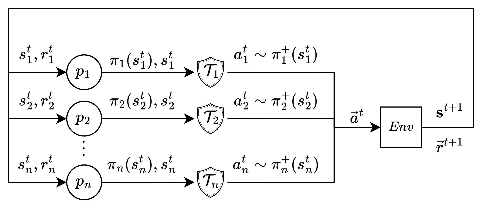

# Safe Neurosymbolic Multi-Agent Reinforcement Learning with Probabilistic Logic Shielding

This repository contains the implementation and experimental code from my [MSc AI Thesis](https://scripties.uba.uva.nl/search?id=record_55229) and [follow-up paper](https://arxiv.org/pdf/2411.04867v1): 

  <strong><em>Towards Safe Neurosymbolic Multi-Agent Reinforcement Learning:
   Experiments in Probabilistic Logic Shielding</em></strong>

The project focuses on enhancing safety, cooperation, and performance in multi-agent reinforcement learning (MARL) environments through the use of Probabilistic Logic Shields (PLS).

| |
|:--:| 
| *Parallel SMARL Interaction Scheme* |

## Abstract (Shortened)

This thesis investigates the integration of Probabilistic Logic Shields (PLS) into Multi-Agent Reinforcement Learning (MARL) to improve safety, cooperation, and performance in complex environments. PLS offers a human-centric, interpretable framework that allows agents to follow high-level safety constraints while learning. Through a range of experiments in single-agent and multi-agent settings, PLS is shown to enhance cooperation and maintain safety standards across various MARL benchmarks. Despite these promising results, challenges such as computational complexity and scalability persist, paving the way for future research into more robust and efficient shielded MARL systems.

## Table of Contents

- [Background](#background)
- [Research Objective](#research-objective)
- [Thesis Contributions](#thesis-contributions)
- [Experiments](#experiments)
- [Usage](#usage)
- [Citing](#citing)
- [License](#license)

## Background

Multi-agent reinforcement learning (MARL) is a rapidly growing field, with applications in areas such as autonomous driving, robotics, finance, and healthcare. However, ensuring the safety and cooperation of agents in these high-stakes environments remains a significant challenge.

Probabilistic Logic Shields (PLS) offer a solution by embedding interpretable symbolic rules into RL systems. This project explores the effectiveness of PLS in enhancing safety, cooperation, and overall performance in MARL environments. By leveraging PLS, we introduce symbolic reasoning to MARL, allowing for more controlled and interpretable agent behaviors.

## Research Objective

The primary goal of this project is to extend PLS to multi-agent reinforcement learning environments, enabling agents to interact safely and cooperatively in shared spaces. The key research questions include:

1. How does PLS impact safety and cooperation in MARL?
2. Can PLS enhance performance in both cooperative and competitive multi-agent settings?
3. What are the limitations and challenges of applying PLS in MARL?

## Thesis Contributions

This repository includes:
- The extension of Probabilistic Logic Shields (PLS) to MARL.
- Implementations of various MARL algorithms (PPO and DQN/SARSA based) with and without PLS, on- and off-policy, and shielded and unshielded (vanilla/baseline).
- Experimental results on multiple benchmark environments:
  - **CartSafe (Single-agent)**
  - **Prisoner's Dilemma**
  - **Stag-Hunt Game**
  - **Extended Public Goods Game**
  - **Centipede Game**
  - **Markov Stag-Hunt**

## Experiments

### 1. Single-Agent Experiments
- **CartSafe**: A reinforcement learning environment for safe decision-making.
  
### 2. Two-Player Normal-Form Games
- **Prisoner’s Dilemma**: Investigates how PLS affects cooperation and defection strategies.
- **Stag-Hunt**: Demonstrates how PLS leads to safer cooperative strategies in equilibrium selection.

### 3. Extensive-Form Games
- **Centipede Game**: Explores long-term cooperation and planning between agents.

### 4. Stochastic Games
- **Extended Public Goods Game**: Shows an example of how to incorporate uncertainty estimation in PLS.
- **Markov Stag-Hunt**: Tests the influence of PLS in dynamic, stochastic environments (grid-world).

## Usage

You can set up and run the code for the experiments locally by following the installation and execution instructions provided in the next sections. This repository has been tested on Windows 11 (AMD CPU), Linux (Ubuntu; Intel CPU) and MacBook (M3).

### Structure of Repository
_Description of repo coming soon._

### Installation

_Installation instructions coming soon._

### Execution

_Execution instructions coming soon._

## Citing

If you use this code in your research, please cite my thesis:

> Chatterji, S. (2024). *Towards Safe Neurosymbolic Multi-Agent Reinforcement Learning: Experiments in Probabilistic Logic Shielding*. MSc Thesis, University of Amsterdam.

Or use this bibtex:

    @mastersthesis{chatterji2024smarl,
      author       = {Satchit Chatterji},
      title        = {Towards Safe Neurosymbolic Multi-Agent Reinforcement Learning: Experiments in Probabilistic Logic Shielding},
      school       = {University of Amsterdam},
      year         = {2024},
      month        = {August},
      note         = {MSc Thesis},
    }

## License

This project is licensed under the MIT License. See the [LICENSE](./LICENSE) file for more details.
